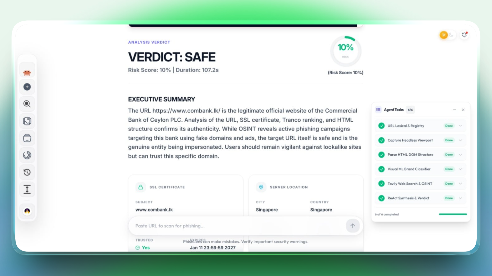
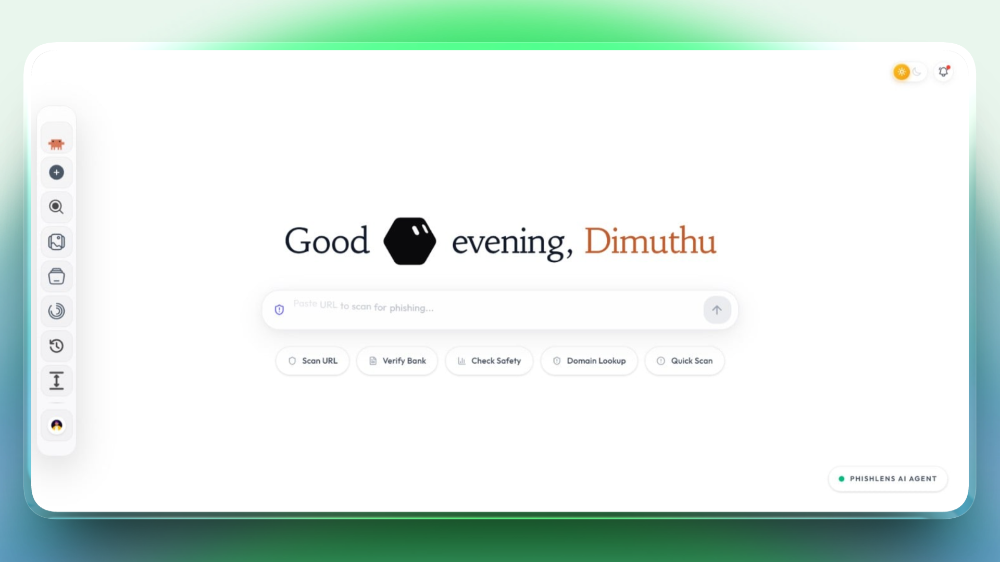
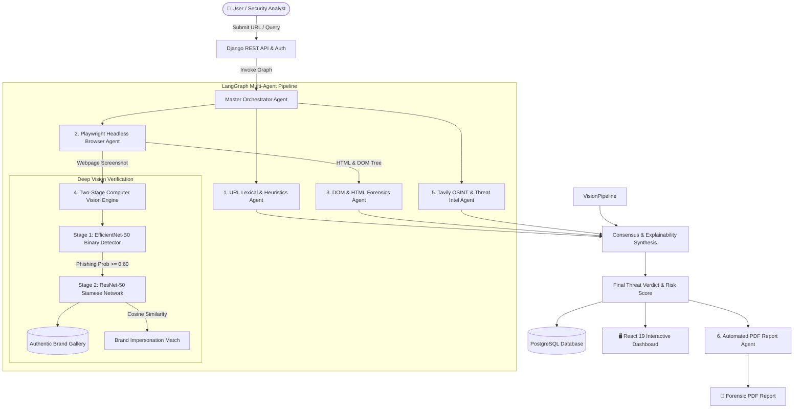

<p align="center">
  
</p>

<h1 align="center">PhishLens Agent: A Visual Similarity-Based Phishing Website Detection System Using Deep Learning and an Agentic AI Framework</h1>

<p align="center">
  <a href="https://github.com/DPramuditha/PhishLens-Agent/actions"></a>
  <a href="https://www.python.org/"></a>
  <a href="https://www.djangoproject.com/"></a>
  <a href="https://react.dev/"></a>
  <a href="https://pytorch.org/"></a>
  <a href="https://langchain-ai.github.io/langgraph/"></a>
  <a href="https://playwright.dev/"></a>
  <a href="https://www.docker.com/"></a>
  <a href="LICENSE"></a>
</p>

---

## 📌 Table of Contents

- [Overview](#-overview)
- [Application Screenshots](#-application-screenshots)
- [Key Features & Innovations](#-key-features--innovations)
- [System Architecture & Multi-Agent Pipeline](#-system-architecture--multi-agent-pipeline)
- [Two-Stage Computer Vision & AI Verification](#-two-stage-computer-vision--ai-verification)
- [Technology Stack](#-technology-stack)
- [Docker Quickstart (Recommended)](#-docker-quickstart-recommended)
- [Local Development Setup](#-local-development-setup)
- [Environment Variables Reference](#-environment-variables-reference)
- [REST API Endpoints](#-rest-api-endpoints)
- [Testing & Quality Assurance](#-testing--quality-assurance)
- [Project Directory Structure](#-project-directory-structure)
- [Contributing & License](#-contributing--license)

---

## 📖 Overview

**PhishLens Agent** is a next-generation, autonomous cybersecurity defense platform designed to analyze, classify, and explain zero-day phishing threats, brand impersonation campaigns, and credential harvesting attacks.

Traditional phishing detection systems rely on static domain blacklists, single-vector heuristic rules, or generic LLM prompts that fail against modern evasive techniques such as dynamic JavaScript cloaking, obfuscated DOM trees, visual logo mimicry, and homoglyph URLs.

PhishLens Agent overcomes these limitations through a **cognitive multi-agent consensus architecture powered by LangGraph**, coupled with a **two-stage PyTorch deep vision pipeline (EfficientNet-B0 + ResNet-50 Siamese Network)**, dynamic **Playwright headless browser execution**, live **OSINT threat intelligence via Tavily**, and automated **forensic PDF security report generation**.

---

## 📸 Application Screenshots

<p align="center">
  
</p>
<p align="center">
  <em>Figure 1: Interactive Cyber Intelligence Dashboard featuring real-time multi-agent execution tracking, live browser analysis, risk scoring, and conversational AI threat investigation.</em>
</p>

<br />

<p align="center">
  
</p>
<p align="center">
  <em>Figure 2: Multi-Agent Deep Threat Investigation & Verification Workflow with detailed agentic chain-of-thought breakdown and forensic evidence assessment.</em>
</p>

---

## ✨ Key Features & Innovations

### 🧠 Autonomous Multi-Agent Cognitive Orchestration
- **LangGraph State Machine**: Orchestrates autonomous worker agents with dynamic task routing, conditional branching, and error-tolerant fallback nodes.
- **Explainable Multi-Vector Reasoning**: Combines URL lexical analysis, DOM anomalies, computer vision scores, and live OSINT to produce transparent, human-readable risk assessments.
- **Stateful Memory & Checkpointing**: Maintains conversation and scan states across multi-turn user interactions using PostgreSQL/SQLite checkpointers.

### 👁️ Two-Stage Computer Vision & Siamese Neural Network
- **Stage 1 (EfficientNet-B0 Classifier)**: Analyzes visual webpage layout and rendered UI artifacts to determine the base probability of a phishing attack.
- **Stage 2 (ResNet-50 Siamese Twin Network)**: Embeds cropped logo and brand assets into a 128-dimensional unit hypersphere with Adaptive Concat Pooling (GAP + GMP) to compute cosine similarity against a verified brand reference gallery (e.g., Microsoft, Google, PayPal, Netflix, Apple, Amazon).

### 🌐 Dynamic Browser Automation & Cloaking Bypass
- **Playwright Headless Chromium**: Renders modern JavaScript single-page applications (React, Angular, Vue) to defeat client-side anti-bot and cloaking scripts.
- **Full-Page Visual Capture**: Captures high-fidelity PNG screenshots for visual inference, user evidence, and PDF reporting.

### 🔎 Deep URL & DOM Structural Forensics
- **URL Lexical & Homoglyph Detection**: Detects Punycode attacks, typosquatting, suspicious TLDs, multi-level subdomains, IP-based URLs, and abnormal entropy.
- **DOM & HTML Feature Extraction**: Analyzes form action targets, credential harvesting inputs, cross-origin scripts, hidden iframes, zero-size elements, and favicon mismatches.

### 🌐 Real-Time OSINT & Threat Intelligence
- **Tavily Web Search Integration**: Queries real-time threat databases, security advisories, and brand domain registries to cross-examine suspicious domains against verified infrastructure.

### 📑 Automated Forensic PDF Report Generation
- **ReportLab PDF Engine**: Generates publication-ready, forensic-grade security intelligence reports with executive summaries, technical risk indicators, evidence screenshots, and incident mitigation steps.

### 🎨 Apple-Inspired Glassmorphic Frontend
- **React 19 & Tailwind CSS**: Modern, fluid user interface featuring glassmorphism, responsive drawer bottom sheets, interactive modals, dark/light theme accents, and animated dot-matrix loaders.
- **Live Agent Execution Stepper**: Real-time visualization of each agent's internal chain-of-thought, tool calls, and execution progress.

---

## 🏗️ System Architecture & Multi-Agent Pipeline



---

## 🔬 Two-Stage Computer Vision & AI Verification

PhishLens Agent addresses the core challenge of visual phishing mimicry with a two-stage deep learning architecture:

```
 Webpage Screenshot (Playwright)
              │
              ▼
   ┌──────────────────────┐
   │ Transforms & Resize  │ ──> [3, 224, 224] Normalized Tensor
   └──────────┬───────────┘
              │
              ▼
   ┌──────────────────────┐
   │   EfficientNet-B0    │ ──> Stage 1: Binary Phishing Score
   │   Binary Detector    │     p ∈ [0.0, 1.0]
   └──────────┬───────────┘
              │
              ├─── (Score < 0.60) ──> Legitimate Visual Layout
              │
              └─── (Score >= 0.60) ──> High-Risk Visual Phishing Detected
                                                │
                                                ▼
                                   ┌───────────────────────────┐
                                   │   ResNet-50 Siamese Twin  │
                                   │   Adaptive Concat Pooling │ (GAP + GMP -> 4096-D)
                                   └────────────┬──────────────┘
                                                │
                                                ▼
                                   ┌───────────────────────────┐
                                   │ 128-D Hypersphere Project │ L2 Normalized Embedding
                                   └────────────┬──────────────┘
                                                │
                                                ▼
                                   ┌───────────────────────────┐
                                   │ Cosine Similarity Search  │ vs. Brand Reference Gallery
                                   └────────────┬──────────────┘
                                                │
                                                ▼
                                   Impersonated Brand Identity Identified
```

1. **Stage 1 (Binary Classification)**:
   - **Backbone**: EfficientNet-B0 pre-trained on ImageNet and fine-tuned on phishing/legitimate webpage captures.
   - **Output**: Calibrated phishing likelihood $p \in [0.0, 1.0]$. Pages scoring $\ge 0.60$ trigger Stage 2.

2. **Stage 2 (Siamese Brand Identification)**:
   - **Backbone**: Twin ResNet-50 encoder backbones with **Adaptive Concat Pooling** (combining Global Average Pooling and Global Max Pooling to preserve both structural silhouette and crisp typography).
   - **Projection**: 128-dimensional unit hypersphere ($L_2$-normalized).
   - **Metric**: Cosine similarity against authentic brand embeddings:
     $$\text{Similarity}(u, v) = \frac{u \cdot v}{\|u\|_2 \|v\|_2}$$

---

## 💻 Technology Stack

| Domain | Technologies |
|---|---|
| **AI & Agent Orchestration** | LangGraph, LangChain, OpenRouter (Nemotron-3-Ultra / Llama 3 / Claude), Azure OpenAI, Tavily OSINT |
| **Computer Vision & ML** | PyTorch, Torchvision, EfficientNet-B0, ResNet-50 (Siamese Network), Pillow |
| **Backend & APIs** | Python 3.11–3.13, Django 5.2, Django REST Framework, Gunicorn, Playwright (Chromium) |
| **Frontend & UI** | React 19, Vite, Tailwind CSS, Lucide React, Framer Motion, Axios |
| **Database & Persistence** | PostgreSQL 16 Alpine, SQLite3 (Local dev), LangGraph Checkpointers |
| **Reporting & Export** | ReportLab (Forensic PDF engine), Canvas DOM Rendering |
| **DevOps & Containers** | Docker, Docker Compose, Nginx Reverse Proxy, Alpine Linux |
| **Testing & CI/CD** | Pytest, Pytest-Django, Vitest, GitHub Actions, ESLint, Flake8, Pip-Audit, Gitleaks |

---

## 🐳 Docker Quickstart (Recommended)

The fastest and most reliable way to run the entire PhishLens Agent platform (Backend, Frontend, and PostgreSQL database) is using Docker Compose.

### Prerequisites
- [Docker Desktop](https://www.docker.com/products/docker-desktop/) (v20.10+ with Docker Compose v2+)

### Step 1: Clone Repository & Configure Environment
```bash
git clone https://github.com/DPramuditha/PhishLens-Agent.git
cd PhishLens-Agent

# Copy Docker environment template
cp .env.docker .env
```

Open `.env` and configure your API keys:
- `OPENROUTER_API_KEY` (or `AZURE_OPENAI_API_KEY`)
- `TAVILY_API_KEY` (for live threat intelligence)

### Step 2: Build & Start All Services
```bash
docker compose up --build -d
```

### Step 3: Access the Application
- 🖥️ **Web UI (Frontend)**: [http://localhost](http://localhost) (or [http://localhost:5173](http://localhost:5173))
- ⚡ **Django REST API**: [http://localhost:8000/api/](http://localhost:8000/api/)
- 🩺 **API Health Check**: [http://localhost:8000/api/health/](http://localhost:8000/api/health/)
- 🗄️ **PostgreSQL Database**: `localhost:5432` (`phishlens_db`)

### Step 4: Useful Docker Management Commands
```bash
# View live logs across all containers
docker compose logs -f

# View backend agent logs specifically
docker compose logs -f backend

# Stop all containers
docker compose down

# Stop and wipe database volumes (clean reset)
docker compose down -v
```

---

## 🛠️ Local Development Setup

For local development without Docker:

### 1. Backend Setup
```bash
# 1. Create and activate a Python virtual environment
python -m venv .venv
source .venv/bin/activate       # On Linux/macOS
# .venv\Scripts\activate        # On Windows

# 2. Install Python dependencies
pip install -r requirements.txt

# 3. Install Playwright Chromium browser binaries
playwright install chromium

# 4. Configure environment variables
cp .env.docker .env

# 5. Apply database migrations
python manage.py migrate

# 6. Start Django development server
python manage.py runserver 8000
```

### 2. Frontend Setup
```bash
# 1. Navigate to frontend directory
cd frontend

# 2. Install Node dependencies
npm install

# 3. Start Vite development server
npm run dev
```

The frontend will be available at [http://localhost:5173](http://localhost:5173).

---

## ⚙️ Environment Variables Reference

| Variable | Required | Default | Description |
|---|:---:|---|---|
| `DEBUG` | Optional | `False` | Enables/disables Django debug mode |
| `DJANGO_SECRET_KEY` | **Yes** | `(random)` | Cryptographic secret for Django sessions |
| `JWT_SECRET` | **Yes** | `(random)` | Secret key used for signing JWT authentication tokens |
| `JWT_EXPIRY_HOURS` | Optional | `24` | Token lifespan before re-authentication |
| `DB_ENGINE` | Optional | `postgresql` | Database engine (`postgresql` or `sqlite3`) |
| `DB_NAME` | Optional | `phishlens_db` | PostgreSQL database name |
| `DB_USER` | Optional | `postgres` | PostgreSQL username |
| `DB_PASSWORD` | Optional | `dimuthu` | PostgreSQL password |
| `DB_HOST` | Optional | `db` (or `localhost`) | PostgreSQL host address |
| `DB_PORT` | Optional | `5432` | PostgreSQL port |
| `LLM_PROVIDER` | Optional | `openrouter` | AI provider (`openrouter` or `azure`) |
| `OPENROUTER_API_KEY` | **Yes** | - | API key for OpenRouter LLM orchestration |
| `OPENROUTER_MODEL` | Optional | `nvidia/nemotron-3-ultra-550b-a55b:free` | Model endpoint for orchestrator reasoning |
| `AZURE_OPENAI_API_KEY`| Optional | - | Azure OpenAI API key (if using Azure) |
| `AZURE_OPENAI_ENDPOINT`| Optional | - | Azure OpenAI endpoint URL |
| `AZURE_OPENAI_DEPLOYMENT`| Optional | `gpt-5.4-mini` | Azure deployment model name |
| `TAVILY_API_KEY` | **Yes** | - | Tavily Search API key for OSINT threat feeds |
| `GOOGLE_CLIENT_ID` | Optional | - | Google OAuth 2.0 Client ID for social login |
| `GOOGLE_CLIENT_SECRET`| Optional | - | Google OAuth 2.0 Client Secret |

---

## 🔌 REST API Endpoints

### 🔍 Threat Scanning & Investigation
- `POST /api/scan/` — Initiate a multi-agent phishing analysis for a target URL.
- `GET /api/scan/status/<session_id>/` — Stream or query live multi-agent execution steps and verdict.
- `GET /api/reports/<session_id>/download/` — Download the generated forensic PDF security report.

### 💬 Chat & Session History
- `GET /api/chats/` — Retrieve all past threat investigation chat sessions for the authenticated user.
- `POST /api/chats/` — Create or resume a threat investigation conversation.
- `DELETE /api/chats/<session_id>/` — Delete an investigation chat and its associated logs.

### 🔐 Authentication & Profile
- `POST /api/auth/register/` — Register a new analyst account.
- `POST /api/auth/login/` — Authenticate with email/password to receive a JWT.
- `POST /api/auth/google/` — Authenticate using Google OAuth 2.0.
- `GET /api/auth/me/` — Retrieve current user profile and scan telemetry.

### 🩺 System Diagnostics
- `GET /api/health/` — Health check endpoint returning backend, DB, and agent status.

---

## 🧪 Testing & Quality Assurance

PhishLens Agent enforces strict test coverage and code reliability across both backend and frontend layers.

```bash
# Run all 180+ Backend unit, integration, and agent tests
pytest

# Run backend tests with code coverage report
pytest -v --cov=backend --cov-report=term

# Run all 44+ Frontend React & component tests
cd frontend
npm test

# Verify production Vite build
npm run build
```

### GitHub Actions CI/CD Pipeline
- **`ci.yml` (Continuous Integration)**:
  - **Backend Matrix**: Tests across Python `3.11`, `3.12`, `3.13` with Flake8 linting and Pytest coverage checks.
  - **Frontend Matrix**: Tests across Node `20.x`, `22.x` with ESLint, Vitest, and Vite bundle validation.
  - **Security Audits**: Scans Python dependencies with `pip-audit`, JavaScript dependencies with `npm audit`, and detects secret leaks with `gitleaks`.
  - **Docker Verification**: Validates multi-stage Dockerfiles and `docker-compose.yml` integrity.
- **`cd.yml` (Continuous Deployment)**:
  - Automatically builds and publishes multi-architecture container images to GitHub Container Registry (`ghcr.io`) upon tag releases (`v*.*.*`).
- **`dependabot.yml`**:
  - Automated weekly dependency and security vulnerability monitoring.

---

## 📂 Project Directory Structure

```text
PhishLens-Agent/
├── .github/
│   ├── workflows/             # GitHub Actions CI/CD (ci.yml, cd.yml)
│   └── dependabot.yml         # Automated dependency vulnerability scanning
├── backend/
│   ├── agents/                # LangGraph Multi-Agent Pipeline
│   │   ├── orchestrator.py    # Master Orchestrator Agent & Graph State Machine
│   │   ├── url_feature_agent.py # URL Lexical & Homoglyph Feature Extraction
│   │   ├── html_dom_agent.py  # DOM, Form, & Script Forensic Agent
│   │   ├── web_scraping_agent.py # Playwright Headless Browser Capture
│   │   ├── visual_model.py    # EfficientNet-B0 & ResNet-50 Siamese Vision Pipeline
│   │   ├── report_generator.py # ReportLab Forensic PDF Generator
│   │   ├── memory.py          # PostgreSQL/SQLite Checkpoint State Manager
│   │   └── views.py           # REST API Views & Streaming Endpoints
│   ├── core/                  # Core Django configurations & security
│   ├── tests/                 # Backend Pytest Test Suites (180+ tests)
│   └── urls.py                # API Routing Configuration
├── docs/
│   └── screenshots/           # Screenshot assets (readme-banner.png, Chat_screenshort.png, Chat-screenshort.png)
├── frontend/
│   ├── src/
│   │   ├── components/        # UI Components (Modals, Steppers, Dashboards)
│   │   ├── pages/             # Pages (HomePage, LandingPage, LoginPage, RegisterPage)
│   │   ├── context/           # Auth & Toast Context Providers
│   │   └── assets/            # SVG icons, illustrations & brand assets
│   ├── tests/                 # Vitest Component & Unit Tests (44+ tests)
│   └── Dockerfile             # Multi-stage Nginx production container
├── models/                    # Pre-trained PyTorch Deep Learning Weights
│   ├── phishing_model_stage1.pth # EfficientNet-B0 Binary Detector Weights
│   └── resnet50_siamese_brand_model.pth # ResNet-50 Siamese Network Weights
├── docker-compose.yml         # Full-stack Docker orchestration definition
├── Dockerfile                 # Backend Django + Playwright + PyTorch container
├── requirements.txt           # Python backend dependencies
├── package.json               # Node frontend root scripts
└── README.md                  # Project Documentation
```

---

## 🤝 Contributing & License

Contributions are welcome! If you would like to improve PhishLens Agent:
1. Fork the repository
2. Create your feature branch (`git checkout -b feature/AmazingFeature`)
3. Commit your changes (`git commit -m 'Add some AmazingFeature'`)
4. Push to the branch (`git push origin feature/AmazingFeature`)
5. Open a Pull Request

This project is licensed under the **Apache License 2.0** - see the [LICENSE](LICENSE) file for details.

---

<p align="center">
  <strong>PhishLens Agent</strong> — Final Year Cybersecurity & Artificial Intelligence Project<br />
  Built with ❤️ for intelligent cyber threat detection and brand protection.
</p>